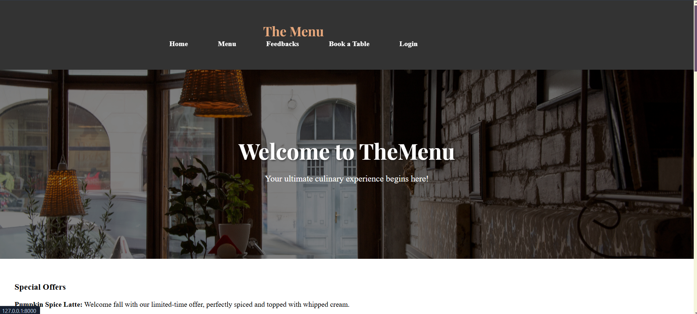
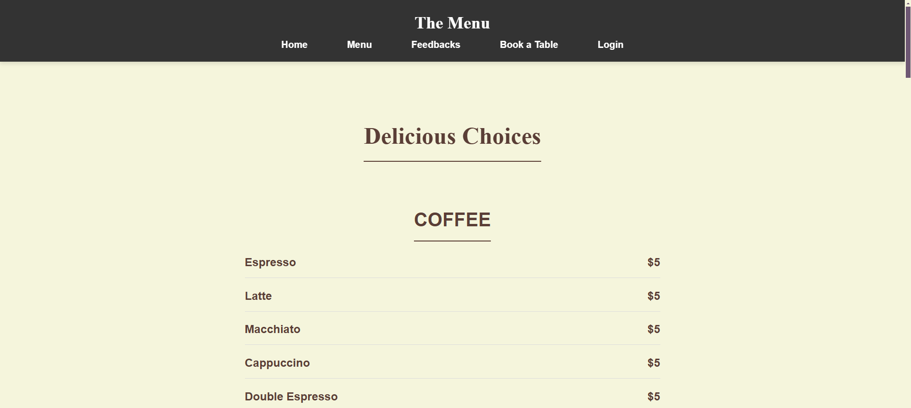
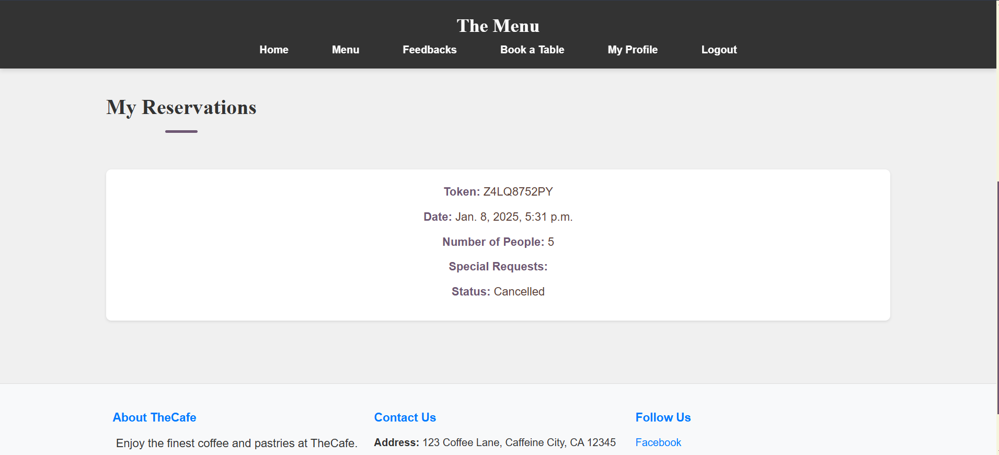
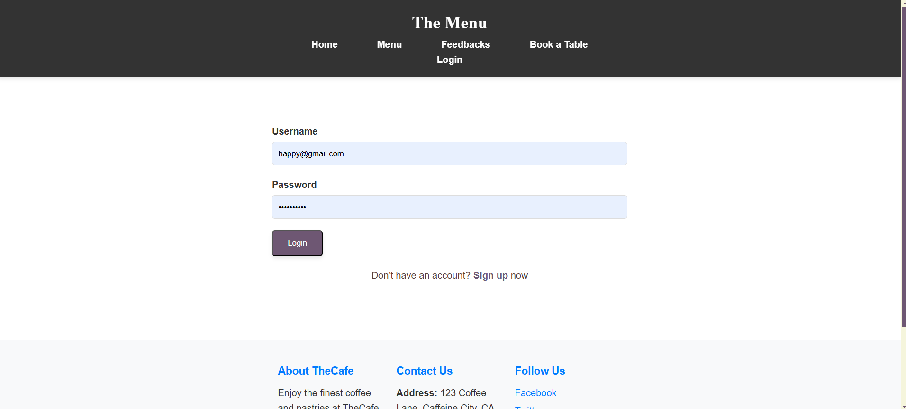

# Café Management Website

## Project Overview
The **Café Management Website** is a web-based platform designed to streamline café operations, enhance customer experience, and provide an intuitive interface for managing orders, reservations, and feedback. The website features a modern UI with a warm and earthy aesthetic, interactive animations, and a user-friendly navigation system.

## Features
- **Home Page**: Welcoming hero section with an image and introductory message.
- **Navigation Bar**: Sticky, well-structured navbar for easy access to different sections.
- **Menu Section**: Displays available café items with text overlays on images.
- **Reservation System**: Allows customers to book tables seamlessly.
- **Customer Feedback**: Section for collecting and displaying customer reviews.
- **Parallax Scrolling**: Enhances the visual appeal of the "About Us" section.
- **Image Hover Effects**: Zoom, grayscale-to-color, overlay, and blur effects.
- **Footer**: Includes social links and contact details.

## Technologies Used
- **Frontend**: HTML, CSS, JavaScript
- **Backend**: Django (Python)
- **Database**: SQLite 
- **Deployment**: Railway.app

## Installation & Setup
1. Clone the repository:
   ```bash
   git clone https://github.com/rakeshp1423/cafe-management.git
   cd cafe-management
   ```
2. Set up a virtual environment:
   ```bash
   python -m venv venv
   source venv/bin/activate  # For Mac/Linux
   venv\Scripts\activate  # For Windows
   ```
3. Install dependencies:
   ```bash
   pip install -r requirements.txt
   ```
4. Run migrations:
   ```bash
   python manage.py migrate
   ```
5. Start the development server:
   ```bash
   python manage.py runserver
   ```
6. Open the browser and visit:
   ```
   http://127.0.0.1:8000/
   ```

## Deployment
- Ensure all environment variables are configured in `.env`.
- Push the project to **Railway.app** or another hosting service.
- Configure database settings for production use.

## Contribution Guidelines
1. Fork the repository.
2. Create a new branch for your feature.
3. Commit and push your changes.
4. Submit a pull request.

## Contact
For queries or contributions, reach out to:
- **Developer**: Rakesh Kumar Patra
- **Email**: rrakeshkuma1423@gmail.com
- **GitHub**: [rakeshp1423](https://github.com/rakeshp1423)

---
**© 2025 Café Management Website. All rights reserved.**


## Screenshots

<table>
  <tr>
    <td></td>
    <td> </td>
   
  </tr>
  <tr>
    <td></td>
    <td></td>
  </tr>
  
</table>
